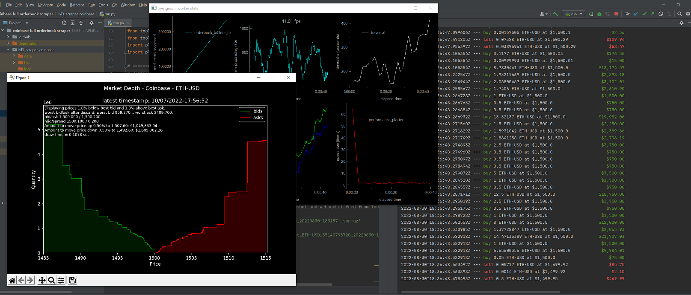

## About The Project

This is a Coinbase 'full' channel (level 3) orderbook scraping bot created primarily as a learning experience by somebody without 
a formal education in computer science or software engineering.

The code has not been audited or looked-over by any external party, and is very likely to be labelled a spaghetti code disaster by
more experienced developers. Despite that, I'm proud of what I have created and what I've learned to be able to build this.

Similarly, despite integration of Rust for the most computationally-intensive functions, memory-safety and thread-safety is not guaranteed 
nor expected. For example, the orderbook's entirely-custom AVL-tree implementation relies heavily on unsafe Rust, and although 
it has passed the unit tests I wrote for it, it fails Miri's experimental stack borrowing checks.

This repo is not intended for distribution and obviously not intended for any sort of production use in its current state. I reserve
the right to abandon the roadmap I outlined below.

[![Python][Python-shield]][Python-url]
[![Rust][Rust-shield]][Rust-url]

## Features 

- Storing orderbook state real-time using AVL-tree orderbook module written in Rust, linked via PyO3.
- Real-time performance monitoring of latency and orderbook operations using PyQTGraph.
- Real-time depth chart plotting in matplotlib.
  - This requires constant AVL tree traversal, a poor use-case for AVL trees (which excel at order insertion and deletion). 
  I hope to explore array-based orderbook implementations in the future (such as those using vectors or slab B-trees). 
- Syncing between Coinbase's level 3 orderbook snapshot and full channel websocket.
  - Coinbase's level 3 orderbook snapshot can only be retrieved through its REST API, whereas its level 3 orderbook update messages
  are retrieved through a websocket connection to its 'full' channel. This discrepancy necessitates a sync mechanism which functions 
  by polling the REST API for the orderbook snapshot while simultaneously placing update messages in a buffer queue, waiting for the 
  snapshot to be retrieved and loaded. Once the snapshot is retrieved, it provides a starting sequence number from which orderbook
  update messages in the queue can either be discarded or back-filled into the orderbook. Extra complexity stems from Coinbase's snapshot
  response providing an earlier sequence than the websocket by roughly 1 second, requiring a delayed snapshot request which is currently
  controlled by a hard-coded value (see the SNAPSHOT_GET_DELAY parameter in *run.py*). If anybody is aware of an alternative 
  to a hardcoded delay value, I would love to hear it!
- Saving deserialized orderbook snapshot and update messages as compressed json.gz files.
  - Loading saved snapshot and update messages into the script. This was useful for testing the script using deterministic inputs, 
  but may also be useful for backtesting if this script is ever incorporated as a data feed into a broader trading framework. 
- Comprehensive logging with the help of Loguru.
- Saving matches and candles into CSVs with the help of Pandas.
  

<!-- GETTING STARTED -->
## Getting Started

### Prerequisites

* Python 3.10+
* Rust 1.64+

### Installation

TBD

(<a href="#readme-top">back to top</a>)

<!-- ROADMAP -->
## Roadmap

- [x] Coinbase Level 3 / Full Orderbook scraper in Python, with depth charting and performance monitoring
    - [x] Depth charting in matplotlib
    - [x] Performance monitoring through simple PyQT5 dashboard
- [ ] Port compute-intensive functions to Rust
    - [x] AVL-tree-based orderbook implementation
    - [x] PyO3 integration
    - [ ] Replace AVL-tree with Slab B-tree for greater cache performance
- [ ] Build market making capability that accepts strategy templates
    - [ ] Basic Avellaneda and Stoikov strategy
    - [ ] Configurable TWAP
    - [ ] Uniswap XYK-style liquidity model
- [ ] Long-term Goals
  - [ ] Support more exchanges (via Barter-data or similar)
  - [ ] Research market making strategies
  - [ ] Blockchain integrations / DEX & Cross-chain arbitrage strategies

(<a href="#readme-top">back to top</a>)

<!-- CONTACT -->
## Contact

[@0xSkelectric](https://twitter.com/0xSkelectric) - Skelectricity@Proton.me

[https://github.com/Skelectric/Algos](https://github.com/Skelectric/Algos)

(<a href="#readme-top">back to top</a>)

<!-- MARKDOWN LINKS & IMAGES -->
<!-- https://www.markdownguide.org/basic-syntax/#reference-style-links -->
[Python-shield]: https://forthebadge.com/images/badges/made-with-python.svg
[Python-url]: https://www.python.org/
[Rust-shield]: https://forthebadge.com/images/badges/made-with-rust.svg
[Rust-url]: https://www.rust-lang.org/
