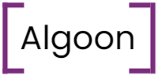

<!-- Improved compatibility of back to top link: See: https://github.com/othneildrew/Best-README-Template/pull/73 -->
<a name="readme-top"></a>
<!--
*** Thanks for checking out the Best-README-Template. If you have a suggestion
*** that would make this better, please fork the repo and create a pull request
*** or simply open an issue with the tag "enhancement".
*** Don't forget to give the project a star!
*** Thanks again! Now go create something AMAZING! :D
-->


<!-- PROJECT SHIELDS -->
<!--
*** I'm using markdown "reference style" links for readability.
*** Reference links are enclosed in brackets [ ] instead of parentheses ( ).
*** See the bottom of this document for the declaration of the reference variables
*** for contributors-url, forks-url, etc. This is an optional, concise syntax you may use.
*** https://www.markdownguide.org/basic-syntax/#reference-style-links
-->

[//]: # ([![Contributors][contributors-shield]][contributors-url])

[//]: # ([![Forks][forks-shield]][forks-url])

[//]: # ([![Stargazers][stars-shield]][stars-url])

[//]: # ([![Issues][issues-shield]][issues-url])

[//]: # ([![MIT License][license-shield]][license-url])
[![LinkedIn][linkedin-shield]][linkedin-url]

[//]: # (Created my free logo at <a href="https://freelogo.me">FreeLogo.me</a>)

<!-- PROJECT LOGO -->
<br />
<div align="center">
  <a href="https://github.com/Skelectric/Algos">
    
  </a>

[//]: # ()
[//]: # (<h3 align="center">project_title</h3>)

[//]: # ()
[//]: # (  <p align="center">)

[//]: # (    project_description)

[//]: # (    <br />)

[//]: # (    <a href="https://github.com/github_username/repo_name"><strong>Explore the docs »</strong></a>)

[//]: # (    <br />)

[//]: # (    <br />)

[//]: # (    <a href="https://github.com/github_username/repo_name">View Demo</a>)

[//]: # (    ·)

[//]: # (    <a href="https://github.com/github_username/repo_name/issues">Report Bug</a>)

[//]: # (    ·)

[//]: # (    <a href="https://github.com/github_username/repo_name/issues">Request Feature</a>)

[//]: # (  </p>)
</div>


<!-- TABLE OF CONTENTS -->
<details>
  <summary>Table of Contents</summary>
  <ol>
    <li>
      <a href="#about-the-project">About The Project</a>
      <ul>
        <li><a href="#built-with">Built With</a></li>
      </ul>
    </li>
    <li>
      <a href="#getting-started">Getting Started</a>
      <ul>
        <li><a href="#prerequisites">Prerequisites</a></li>
        <li><a href="#installation">Installation</a></li>
      </ul>
    </li>
    <li><a href="#usage">Usage</a></li>
    <li><a href="#roadmap">Roadmap</a></li>
    <li><a href="#contact">Contact</a></li>
  </ol>
</details>


<!-- ABOUT THE PROJECT -->
## About The Project

[//]: # ([![Product Name Screen Shot][product-screenshot]]&#40;https://example.com&#41;)

Algoon is a work-in-progress algorithmic trading bot.

This is a labor of love and learning by somebody with no formal background in computer science or software development.
Most functionality use custom data structures and algorithms that have been tested rigorously, but not by any industry-standards.

Despite integration of Rust for the most computationally-intensive functions, memory-safety and thread-safety is not guaranteed or expected.
For example, the orderbook's AVL tree implementation relies heavily on unsafe Rust, and although 
it appears functional in testing, it fails Miri's stack borrowing checks.

Please reach out if you have any questions!

<p align="right">(<a href="#readme-top">back to top</a>)</p>


### Built With

* [![Python][Python-shield]][Python-url]
* [![Rust][Rust-shield]][Rust-url]


<p align="right">(<a href="#readme-top">back to top</a>)</p>


<!-- GETTING STARTED -->
## Getting Started

TBD

### Prerequisites

* Python 3.10+

[//]: # (  ```sh)

[//]: # (  npm install npm@latest -g)

[//]: # (  ```)
* Rust 1.64+

### Installation

TBD

[//]: # (1. Get a free API Key at [https://example.com]&#40;https://example.com&#41;)

[//]: # (2. Clone the repo)

[//]: # (   ```sh)

[//]: # (   git clone https://github.com/github_username/repo_name.git)

[//]: # (   ```)

[//]: # (3. Install NPM packages)

[//]: # (   ```sh)

[//]: # (   npm install)

[//]: # (   ```)

[//]: # (4. Enter your API in `config.js`)

[//]: # (   ```js)

[//]: # (   const API_KEY = 'ENTER YOUR API';)

[//]: # (   ```)

<p align="right">(<a href="#readme-top">back to top</a>)</p>


<!-- USAGE EXAMPLES -->
## Usage

TBD

[//]: # (Use this space to show useful examples of how a project can be used. Additional screenshots, code examples and demos work well in this space. You may also link to more resources.)

[//]: # ()
[//]: # (_For more examples, please refer to the [Documentation]&#40;https://example.com&#41;_)

<p align="right">(<a href="#readme-top">back to top</a>)</p>


<!-- ROADMAP -->
## Roadmap

- [x] Coinbase Level 3 / Full Orderbook scraper in Python, with depth charting and performance monitoring
    - [x] Depth charting in matplotlib
    - [x] Performance monitoring through simple PyQT5 dashboard
- [ ] Port compute-intensive functions to Rust
    - [x] AVL-tree-based orderbook implementation
    - [ ] PyO3 integration
    - [ ] Replace AVL-tree with Slab B-tree for greater cache performance
- [ ] Build market making capability that accepts strategy templates
    - [ ] Basic Avellaneda and Stoikov strategy
    - [ ] Configurable TWAP
    - [ ] Uniswap XYK-style liquidity model
- [ ] Support more exchanges (via Barter-data or similar)
- [ ] Blockchain integrations / DEX & Cross-chain arbitrage strategies

See the [open issues](https://github.com/github_username/repo_name/issues) for a full list of proposed features (and known issues).

<p align="right">(<a href="#readme-top">back to top</a>)</p>


[//]: # (<!-- CONTRIBUTING -->)

[//]: # (## Contributing)

[//]: # ()
[//]: # (Contributions are what make the open source community such an amazing place to learn, inspire, and create. Any contributions you make are **greatly appreciated**.)

[//]: # ()
[//]: # (If you have a suggestion that would make this better, please fork the repo and create a pull request. You can also simply open an issue with the tag "enhancement".)

[//]: # (Don't forget to give the project a star! Thanks again!)

[//]: # ()
[//]: # (1. Fork the Project)

[//]: # (2. Create your Feature Branch &#40;`git checkout -b feature/AmazingFeature`&#41;)

[//]: # (3. Commit your Changes &#40;`git commit -m 'Add some AmazingFeature'`&#41;)

[//]: # (4. Push to the Branch &#40;`git push origin feature/AmazingFeature`&#41;)

[//]: # (5. Open a Pull Request)

[//]: # ()
[//]: # (<p align="right">&#40;<a href="#readme-top">back to top</a>&#41;</p>)


[//]: # (<!-- LICENSE -->)

[//]: # (## License)

[//]: # ()
[//]: # (Distributed under the MIT License. See `LICENSE.txt` for more information.)

[//]: # ()
[//]: # (<p align="right">&#40;<a href="#readme-top">back to top</a>&#41;</p>)


<!-- CONTACT -->
## Contact

[@0xSkelectric](https://twitter.com/0xSkelectric) - Skelectricity@Proton.me

[https://github.com/Skelectric/Algos](https://github.com/Skelectric/Algos)

<p align="right">(<a href="#readme-top">back to top</a>)</p>


[//]: # (<!-- ACKNOWLEDGMENTS -->)

[//]: # (## Acknowledgments)

[//]: # ()
[//]: # (* []&#40;&#41;)

[//]: # (* []&#40;&#41;)

[//]: # (* []&#40;&#41;)

[//]: # ()
[//]: # (<p align="right">&#40;<a href="#readme-top">back to top</a>&#41;</p>)


<!-- MARKDOWN LINKS & IMAGES -->
<!-- https://www.markdownguide.org/basic-syntax/#reference-style-links -->
[contributors-shield]: https://img.shields.io/github/contributors/github_username/repo_name.svg?style=for-the-badge
[contributors-url]: https://github.com/github_username/repo_name/graphs/contributors
[forks-shield]: https://img.shields.io/github/forks/github_username/repo_name.svg?style=for-the-badge
[forks-url]: https://github.com/github_username/repo_name/network/members
[stars-shield]: https://img.shields.io/github/stars/github_username/repo_name.svg?style=for-the-badge
[stars-url]: https://github.com/github_username/repo_name/stargazers
[issues-shield]: https://img.shields.io/github/issues/github_username/repo_name.svg?style=for-the-badge
[issues-url]: https://github.com/github_username/repo_name/issues
[license-shield]: https://img.shields.io/github/license/github_username/repo_name.svg?style=for-the-badge
[license-url]: https://github.com/github_username/repo_name/blob/master/LICENSE.txt
[linkedin-shield]: https://img.shields.io/badge/-LinkedIn-black.svg?style=for-the-badge&logo=linkedin&colorB=555
[linkedin-url]: https://www.linkedin.com/in/philip-kirsanov-08273337/
[product-screenshot]: images/screenshot.png
[Python-shield]: https://forthebadge.com/images/badges/made-with-python.svg
[Python-url]: https://www.python.org/
[Rust-shield]: https://forthebadge.com/images/badges/made-with-rust.svg
[Rust-url]: https://www.rust-lang.org/